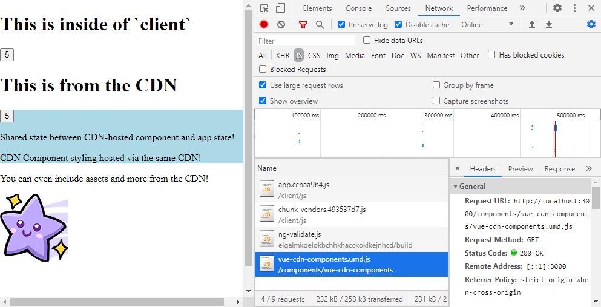

# Vue Components Rendered from CDN Via Network Request

- `npm run build:components` to build the component system UMD+CSS files
- `npm run build:client` to build the base app that contains it's own state/etc
- `npm run start:server` to start the static server that costs the CDN content and app in seperate routes

Then, go to [`localhost:3000`](http://localhost:3000) in order to see the app render
both the local components, and the CDN UMD components rendered and sharing state as if it were all in one app

## How it works

- There are two main apps, two main libraries:
  - [Client (App)](./apps/client)
  - [Server (App)](./apps/server)
  - [Base (Lib)](./libs/vue-cdn-base)
  - [Components (Lib)](./libs/vue-cdn-components)

[The server does nothing other than act as a CDN for the client and the server](./apps/server/src/main.ts#L15)

The base library contains the following:
  - [Symbols used by Vue to provide/inject data from `Client` to `Components`](./libs/vue-cdn-base/src/lib/constants/symbols.ts)
  - [Compositions to abstract away usage of the Symbols for easier consumption](./libs/vue-cdn-base/src/lib/compositions/useAppNumber.ts)

It is treated as a singleton, where it is [injected into `window` from the client](./apps/client/src/main.ts#L9) and [`imports` to the `Base` lib are mutated by the Webpack build of the Components](./libs/vue-cdn-components/configure-webpack.js)

`vue` is made into a `window` singleton in the same way (injected into the window by the client, libs' build's redirect `import`s to `window['VUE']`)

You build the `base` library into a `UMD.js` file using Webpack to mutate imports by the `build:components` command

Finally, once these components are hosted by the server CDN, [you import them into the window by dynamically creating `script` tags](./apps/client/src/main.ts#L15)

These components are added as global Vue tags and is [rendered by using the dynamic `component :is` loader](./apps/client/src/App.vue#L11)
